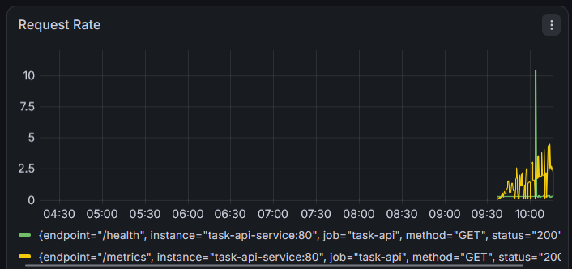
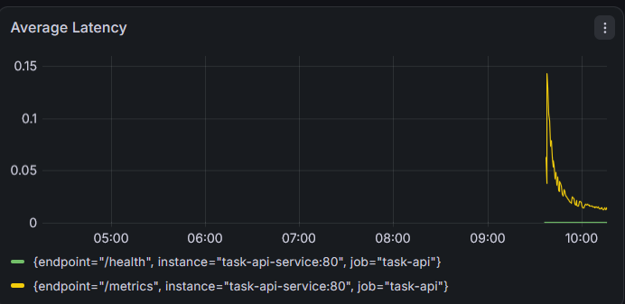

# Task API — DevOps Portfolio Project

A REST API for managing tasks, built as an end-to-end DevOps project covering
containerization, CI/CD with security scanning, Kubernetes deployment, and
GitOps.

## What this project demonstrates

- **Application**: A Flask REST API (`app.py`) with full CRUD endpoints,
  tested with `pytest`.
- **Containerization**: Packaged with Docker (`Dockerfile`), including a
  health check.
- **CI/CD with security scanning**: A GitHub Actions pipeline
  (`.github/workflows/ci.yml`) that on every push:
  - Runs the automated test suite
  - Scans the codebase for accidentally committed secrets (Gitleaks)
  - Builds the Docker image and scans it for known vulnerabilities (Trivy)
- **Kubernetes deployment**: Manifests (`k8s/deployment.yaml`,
  `k8s/service.yaml`) that run the app with 2 replicas, liveness/readiness
  health checks, and resource limits.
- **GitOps**: ArgoCD is configured to watch this repository's `k8s/` folder
  and keep the cluster's state in sync with what's committed to Git —
  deployments happen by pushing to GitHub, not by running `kubectl` by hand.
- **Monitoring**: Prometheus and Grafana track request rate and latency in
  real time (see Monitoring section below).

## Architecture

## Endpoints

| Method | Path          | Description     |
|--------|---------------|------------------|
| GET    | /health       | Health check      |
| GET    | /tasks        | List all tasks     |
| POST   | /tasks        | Create a task        |
| PATCH  | /tasks/<id>   | Update a task         |
| DELETE | /tasks/<id>   | Delete a task          |

## Run locally

**With Docker:**
```bash
docker build -t task-api .
docker run -p 5000:5000 task-api
```

**With Kubernetes (Minikube):**
```bash
minikube start --driver=docker
minikube image load task-api:latest
kubectl apply -f k8s/deployment.yaml
kubectl apply -f k8s/service.yaml
minikube service task-api-service
```

**With ArgoCD (GitOps):**
Once ArgoCD is installed in the cluster, create an Application pointing at
this repo's `k8s/` path, then sync — no manual `kubectl apply` needed for
future changes.

## Monitoring

To observe the API's behavior in production, I added Prometheus for metrics
collection and Grafana for visualization, both deployed to the same
Kubernetes cluster (`k8s/prometheus.yaml`, `k8s/grafana.yaml`).

The Flask app exposes a `/metrics` endpoint that Prometheus scrapes at a
regular interval. Two dashboard panels track the metrics that matter most
for an API's health:

**Request Rate** — requests per second, broken down by endpoint and status
code, computed with `rate(task_api_requests_total[1m])`.



**Average Latency** — mean response time, computed by dividing the latency
histogram's sum by its count
(`task_api_request_latency_seconds_sum / task_api_request_latency_seconds_count`).



Together these give a quick read on both traffic volume and response
performance without needing to dig through raw logs.

**Run it locally:**
```bash
kubectl apply -f k8s/prometheus.yaml
kubectl apply -f k8s/grafana.yaml
minikube service grafana-service
```

## What I learned building this

- Debugging real infrastructure issues: BIOS virtualization settings, PATH
  configuration on Windows, Docker driver connectivity, DNS resolution
  failures when pulling container images, and resource-constrained
  environments.
- How CI/CD pipelines gate code quality and security before deployment.
- How GitOps decouples "what should be running" (declared in Git) from
  "what is running" (reconciled automatically by ArgoCD).
- How to instrument an app with Prometheus metrics and visualize them in
  Grafana to observe real request rate and latency behavior.

## Resilience testing

To verify the deployment actually recovers from failure (not just runs),
I manually killed one of the two running pods and observed Kubernetes'
self-healing behavior:

```bash
$ kubectl get pods
NAME                        READY   STATUS    RESTARTS   AGE
task-api-65b66cb948-64zk8   1/1     Running   0          45m
task-api-65b66cb948-hmf6p   1/1     Running   1          45m

$ kubectl delete pod task-api-65b66cb948-64zk8
pod "task-api-65b66cb948-64zk8" deleted

$ kubectl get pods
NAME                        READY   STATUS    RESTARTS   AGE
task-api-65b66cb948-7bv9z   1/1     Running   0          38s   <- new pod, auto-created
task-api-65b66cb948-hmf6p   1/1     Running   1          46m
```

**Result:** Kubernetes detected the missing replica (the Deployment's
`replicas: 2` spec) and automatically scheduled a replacement pod within
38 seconds — no manual intervention. The `/health` endpoint remained
reachable throughout via the Service, confirming the app stayed available
during the disruption.

## What's next

- Applying this same pipeline to a real small organization's project.